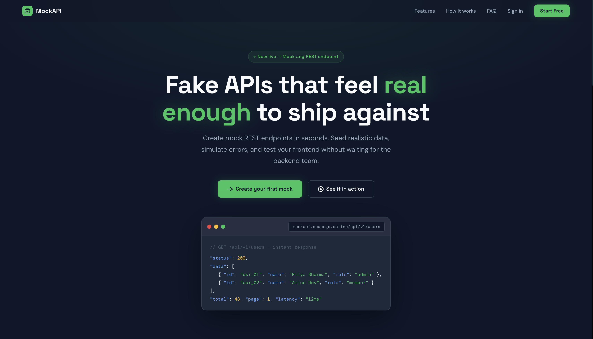
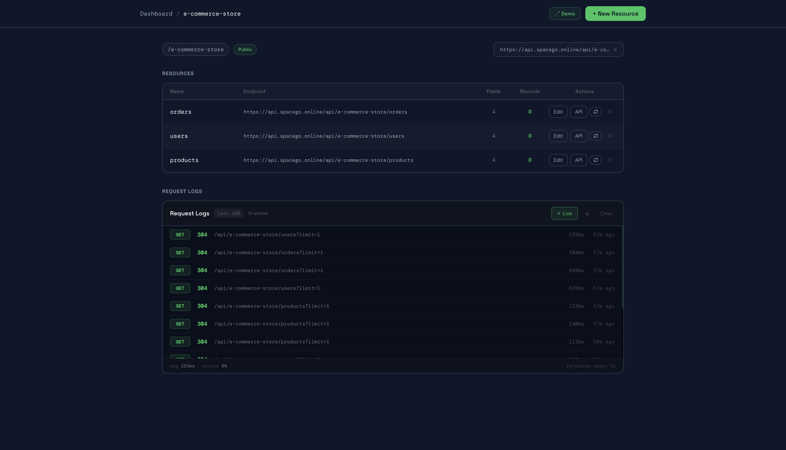
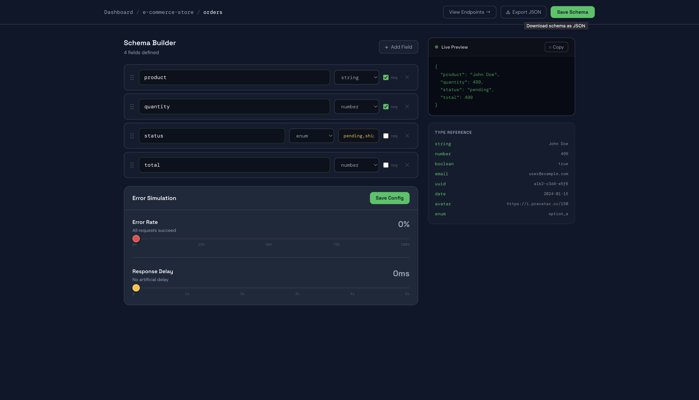
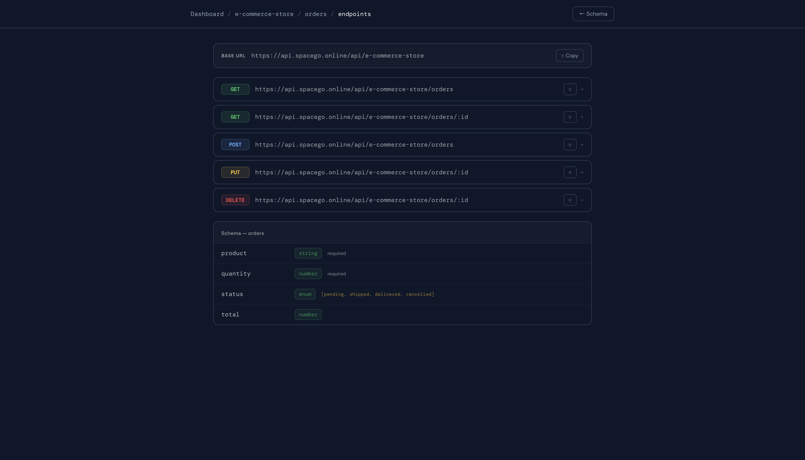

# MockAPI

A platform to create and manage mock REST APIs without writing backend code. Define a schema, get working endpoints with fake data instantly.

**Live:** https://mockapi.spacego.online

---


---

## Features

- **Schema Builder** — visual field editor with drag-to-reorder, live JSON preview, type reference
- **Fake Data Engine** — 10 records auto-seeded on resource create via Faker.js; re-seed anytime
- **Dynamic Endpoints** — full REST CRUD auto-generated per resource (public, no auth required)
- **Query Support** — pagination, sorting, and filtering out of the box
- **Error Simulation** — configurable error rate and response delay per resource
- **Request Logs** — last 100 requests per project, auto-refresh
- **Shareable Demo** — public demo page per project, no login required
- **Email Verification** — OTP-based email verify on register; bcrypt-hashed OTP storage
- **Account Security** — login lockout after 3 wrong attempts (15 min), rate limiting on all auth routes

---

## Project Structure

```
MockAPI/
├── client/                  # React + Vite frontend
│   ├── src/
│   │   ├── pages/           # Landing, Login, Register, VerifyOTP, ForgotPassword,
│   │   │                    # ResetPassword, Dashboard, ProjectDetail, SchemaBuilder,
│   │   │                    # EndpointViewer, ShareableDemo, Settings, NotFound
│   │   ├── components/      # ConfirmModal, Skeleton, RequestLogsPanel,
│   │   │                    # ErrorSimConfig, CodeSnippet, EndpointTable,
│   │   │                    # FieldRow, LivePreview, ProjectCard, ResourceTable,
│   │   │                    # Navbar, Sidebar, Toast
│   │   ├── contexts/        # AuthContext, ToastContext
│   │   ├── hooks/           # useAuth, useProjects
│   │   └── lib/             # axios (JWT interceptor with 401 auto-logout)
│   └── package.json
├── server/                  # Node.js + Express backend
│   ├── app.js               # Express app factory (imported by index.js + tests)
│   ├── index.js             # Entry point — DB connect + server listen
│   ├── controllers/         # authController, resourceController
│   ├── middlewares/         # auth, pipeline (engine), errorHandler
│   ├── models/              # User, Project, Resource, DynamicData, RequestLog
│   ├── routes/              # auth, projects, resources, engine
│   ├── services/            # schemaService, fakerService, cacheService, queryService
│   ├── tests/               # auth, engine, rateLimiter test suites (Jest + Supertest)
│   └── package.json
└── README.md
```

---

## Getting Started

### Prerequisites

- Node.js 18+
- MongoDB 6+ (local) or MongoDB Atlas

### Installation

```bash
# Clone
git clone https://github.com/code-by-RJ/MockAPI.git
cd MockAPI

# Install server deps
cd server && npm install

# Install client deps
cd ../client && npm install
```

### Environment Variables

Create `server/.env`:

```env
PORT=8000
NODE_ENV=development
MONGODB_URI=mongodb://localhost:27017/mockapi
JWT_SECRET=your_jwt_secret_here
CLIENT_URL=http://localhost:5173
RESEND_API_KEY=your_resend_api_key_here
```

> `JWT_SECRET` and `RESEND_API_KEY` are required in all environments.  
> `MONGODB_URI` and `CLIENT_URL` are required in production — server exits on start if missing.

### Running Locally

```bash
# Terminal 1 — backend
cd server && npm run dev

# Terminal 2 — frontend
cd client && npm run dev
```

App available at `http://localhost:5173`

### Running Tests

```bash
cd server && npm test
```

Tests use `mongodb-memory-server` — no real DB connection needed.

---

## API Reference

### Auth

```
POST   /api/auth/register              { name, email, password }
POST   /api/auth/login                 { email, password }
GET    /api/auth/me                    Authorization: Bearer <token>

POST   /api/auth/verify-otp            { email, otp }
POST   /api/auth/verify-reset-otp      { email, otp }
POST   /api/auth/resend-otp            { email, type }   — type: 'verify' | 'reset'
POST   /api/auth/forgot-password       { email }
POST   /api/auth/reset-password        { email, otp, password }
```

### Profile *(requires auth)*

```
PUT    /api/auth/profile               { name }
PUT    /api/auth/change-password       { currentPassword, newPassword }
POST   /api/auth/request-email-change  { currentPassword, newEmail }
POST   /api/auth/confirm-email-change  { otp }
```

### Projects *(requires auth)*

```
GET    /api/projects
POST   /api/projects                   { name, isPublic? }
PATCH  /api/projects/:slug             { name?, isPublic? }
DELETE /api/projects/:slug
```

### Resources *(requires auth)*

```
GET    /api/projects/:slug/resources
POST   /api/projects/:slug/resources          { name, schema? }
PUT    /api/projects/:slug/resources/:name    { schema }
DELETE /api/projects/:slug/resources/:name

POST   /api/projects/:slug/resources/:name/seed          — re-seed 10 fresh records
PUT    /api/projects/:slug/resources/:name/config        { errorRate?, delay? }
GET    /api/projects/:slug/logs
```

### Dynamic Engine *(public — no auth)*

```
GET    /api/:slug/:resource              ?page=1&limit=10&sort=-createdAt&filter=name:john
GET    /api/:slug/:resource/:id
POST   /api/:slug/:resource             { ...fields }
PUT    /api/:slug/:resource/:id         { ...fields }
DELETE /api/:slug/:resource/:id
```

**Rate limits:** 100 req / 15 min per IP · 1000 req / day (auth) · 300 req / day (IP fallback)

---

## Security

| Layer | Detail |
|---|---|
| Helmet.js | HTTP security headers (CSP, X-Frame-Options, etc.) |
| mongo-sanitize | Strips `$` and `.` keys — prevents NoSQL injection |
| bcrypt | Passwords hashed at cost 10; OTPs hashed at cost 6 |
| Rate limiting | Per-route limits on auth, OTP, email, and engine |
| Account lockout | 3 wrong passwords → 15 min lock |
| Body size limit | 50 kb max on all routes |
| isPublic guard | Private project endpoints require owner JWT |
| Email normalization | All emails lowercased + trimmed before DB ops |
| Password policy | Min 8 chars, must include letters and numbers |

---

## Production Deployment

### Backend — Render

| Setting | Value |
|---|---|
| Build command | `cd server && npm install` |
| Start command | `node index.js` |
| Root directory | `server` |

**Env vars on Render:**

```
NODE_ENV=production
MONGODB_URI=<atlas-connection-string>
JWT_SECRET=<strong-random-secret>
CLIENT_URL=https://mockapi.spacego.online
PORT=8000
RESEND_API_KEY=<your-resend-key>
```

### Frontend — Vercel

| Setting | Value |
|---|---|
| Framework | Vite |
| Root directory | `client` |
| Build command | `npm run build` |
| Output directory | `dist` |

**Env var on Vercel:**

```
VITE_API_URL=https://api.spacego.online/api
```

### DNS — Hostinger

```
CNAME  mockapi  →  cname.vercel-dns.com
CNAME  api      →  mockapi-backend-kri9.onrender.com
```

---

## Screenshots

### Landing Page


### Dashboard


### Schema Builder


### Endpoint Viewer


---

## License

MIT